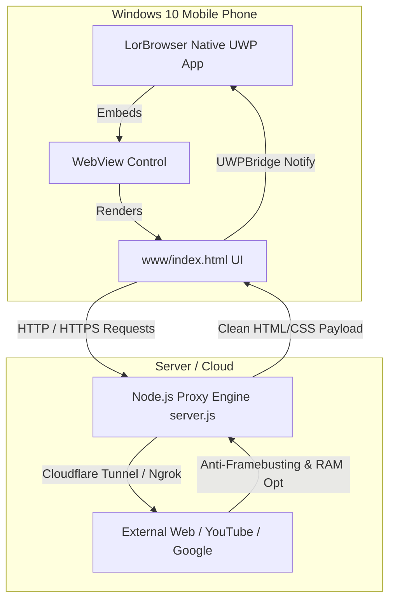

# 🚀 LorBrowser - Modern Web Browser for Windows 10 Mobile

[](https://github.com/Loren-SMServices/lorbrowser/actions/workflows/build-uwp.yml)
[](https://microsoft.com)
[](https://dotnet.microsoft.com)
[](LICENSE)

**LorBrowser** es un navegador web moderno, ligero y optimizado para dispositivos **Windows 10 Mobile** (Microsoft Lumia 950/XL, Lumia 640, etc.). Soluciona los bloqueos de renderizado y cierres por falta de memoria (OOM) en sitios web modernos (Google, YouTube, Wikipedia, X/Twitter, Reddit) combinando un contenedor nativo **UWP (C# / XAML)** con un motor ligero HTML5/JS y un servidor proxy intermediario (**`server.js`**).

---

## 📸 Características Principales

- 🎭 **User-Agent Spoofing en Tiempo Real**: Reemplaza dinámicamente el User-Agent a nivel de proceso (`urlmon.dll`) y motor JS. Incluye perfiles para *Chrome Android 14*, *Safari iOS 17*, *Chrome Desktop Windows 11*, *Firefox Mobile* y *Edge W10M Nativo*.
- 📱 **Experiencia Nativa Windows 10 Mobile**:
  - **Barra de estado integrada**: Estilizado en negro nativo mediante *Reflexión C#* sin requerir SDKs móviles rígidos en compilación.
  - **Navegación con botón físico Atrás**: Interceptación del botón Atrás de hardware en teléfonos Lumia para retroceder pestañas sin cerrar la aplicación.
  - **Modo de navegación inferior (Bottom Bar)**: Barra de direcciones y controles colocados al alcance del pulgar para uso con una sola mano.
- ⚡ **Optimización para YouTube y RAM Reducida**: Inyección de scripts anti-framebusting y mitigación de consumos masivos de memoria RAM en terminales con 1 GB o 2 GB.
- 📂 **Gestión de Pestañas y Marcadores**: Pestañas múltiples con tarjetas de vista previa, panel *Speed Dial* personalizable e historial persistente (`localStorage`).
- ☁️ **Compilación 100% Gratuita en la Nube**: Flujo integrado de **GitHub Actions** que genera paquetes instalables `.appx` para arquitecturas **ARM** (móviles) y **x86** automáticamente.

---

## 🛠️ Tecnologías Utilizadas

### 1. Cliente Nativo (UWP Shell)
- **Lenguaje**: C# 7.3 & XAML
- **Plataforma**: Universal Windows Platform (UAP 10.0.15063 - 10.0.19041)
- **Control de Navegación**: `Windows.UI.Xaml.Controls.WebView` (`ms-appx-web`)
- **Integración con el SO**: Interoperabilidad con `urlmon.dll` (`UrlMkSetSessionOption`), `Windows.UI.ViewManagement.StatusBar` y `SystemNavigationManager`.

### 2. Motor Web Frontend (Interfaz)
- **HTML5 & Vanilla CSS**: Sistema de diseño responsivo compatible con el motor **EdgeHTML 13** de Windows 10 Mobile (sin dependencia de variables CSS dinámicas).
- **JavaScript ES5**: Código sin operadores ES2020 (`?.`) para garantizar cero errores de sintaxis en EdgeHTML.
- **Puente UWP-JS (`UWPBridge`)**: Comunicación bidireccional entre C# y la web vía `window.external.notify` y `InvokeScriptAsync`.

### 3. Servidor Proxy Acelerador (`server.js`)
- **Entorno**: Node.js & Express
- **Proxy Inverso**: `http-proxy-middleware`
- **Túneles Seguros**: Generación automática de HTTPS con `cloudflared` (Cloudflare Tunnels).
- **Herramientas**: Renderizado de código QR en terminal (`qrcode-terminal`) para conectar el móvil escaneando la pantalla.

### 4. Integración Continua (CI/CD)
- **GitHub Actions**: Compilación paralela en servidores de Microsoft mediante MSBuild para generar instaladores sideload `.appx`.

---

## 🏗️ Arquitectura del Sistema



---

## 🚀 Cómo Empezar / Instalación

### Opción A: Instalar el paquete `.appx` en el Móvil (Recomendado)

1. Ve a la pestaña [Releases](https://github.com/Loren-SMServices/lorbrowser/releases) o descarga el **Artifact** de la última ejecución en [GitHub Actions](https://github.com/Loren-SMServices/lorbrowser/actions).
2. Extrae el archivo comprimido para obtener **`LorBrowser.appx`**.
3. En tu teléfono Windows 10 Mobile, activa el **Modo Programador**:
   - *Configuración ⚙️ -> Actualización y seguridad -> Para programadores -> Activar Modo de desarrollo*.
4. Copia el archivo `.appx` a la memoria interna o tarjeta SD del móvil.
5. Abre la aplicación **Explorador de archivos** en el teléfono, pulsa sobre `LorBrowser.appx` y confirma la instalación.

---

### Opción B: Ejecutar el Servidor Proxy Localmente

Si deseas utilizar el servidor proxy intermediario para acelerar sitios pesados y esquivar bloqueos de CORS/iframe:

1. Clona el repositorio:
   ```bash
   git clone https://github.com/Loren-SMServices/lorbrowser.git
   cd lorbrowser
   ```

2. Instala las dependencias:
   ```bash
   npm install
   ```

3. Inicia el servidor:
   ```bash
   node server.js
   ```

4. El servidor generará un código QR en la consola y expondrá la URL local (e.g. `http://localhost:3000`) o pública vía Cloudflare Tunnel.

---

### Opción C: Compilar el Proyecto Localmente con MSBuild / Visual Studio

Requisitos: Visual Studio 2017/2019/2022 con la carga de trabajo de **Desarrollo de la Plataforma universal de Windows (UWP)**.

1. Abre la solución `LorBrowser.sln` en Visual Studio.
2. Selecciona la configuración **Release** y la plataforma objetivo:
   - **ARM**: Para instalar en teléfonos Windows 10 Mobile.
   - **x86**: Para probar en el emulador de Windows 10 Mobile o PC.
3. Compila el proyecto desde PowerShell o la consola de desarrollo:
   ```powershell
   msbuild LorBrowser.csproj /p:Configuration=Release /p:Platform=ARM /p:GenerateAppxPackageOnBuild=true
   ```

---

## 📄 Estructura del Proyecto

```text
lorbrowser/
├── .github/workflows/
│   └── build-uwp.yml          # Flujo de CI/CD para compilación automatizada en GitHub Actions
├── Assets/                     # Iconos y pantallas de carga de la aplicación UWP
├── www/
│   ├── index.html             # Interfaz de usuario principal y motor JavaScript bundles
│   ├── css/style.css          # Hojas de estilo adaptadas a EdgeHTML 13
│   └── js/                    # Módulos JS (Tabs, Bookmarks, UA Profiles, UWP Bridge)
├── App.xaml / App.xaml.cs     # Punto de entrada nativo de la aplicación UWP
├── MainPage.xaml / .cs        # Vista principal C# con integración de StatusBar y WebView
├── Package.appxmanifest       # Manifiesto de empaquetado y capacidades de Windows 10 UWP
├── LorBrowser.csproj          # Archivo de proyecto MSBuild
├── server.js                  # Servidor proxy en Node.js y optimizador YouTube
└── generate_assets.js         # Script utilitario para generación de iconos PNG
```

---

## 🤝 Contribuciones

¡Las contribuciones son bienvenidas! Si deseas mejorar el rendimiento en EdgeHTML, agregar nuevos perfiles de User-Agent o pulir la interfaz:

1. Haz un **Fork** del repositorio.
2. Crea tu rama de función (`git checkout -b feature/nueva-funcion`).
3. Realiza tus cambios y haz **Commit** (`git commit -m 'Añade nueva función'`).
4. Sube los cambios (`git push origin feature/nueva-funcion`).
5. Abre un **Pull Request**.

---

## 📜 Licencia

Este proyecto está bajo la Licencia **MIT**. Consulta el archivo `LICENSE` para más detalles.
